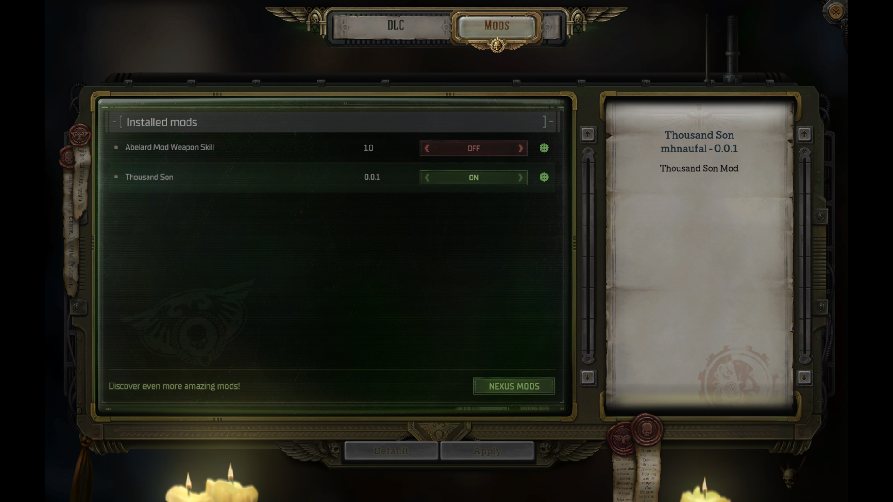
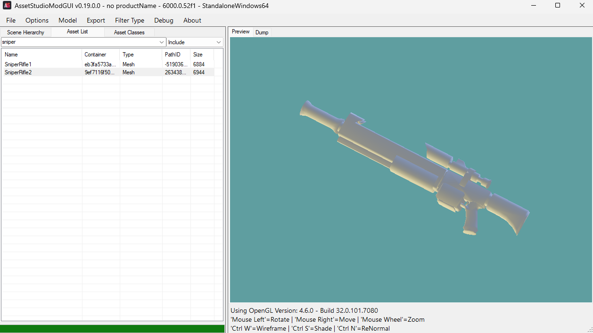

# Warhammer 40.000: Rogue Trader Mod 🦉

**⚠️ This code is comes from Warhammer 40.000: Rogue Trader. License is belong to Warhammer 40.000: Rogue Trader. You need to have the game to use this mod.**

## II. NOTES

Each of the party members has at least a couple of blueprints. Let’s look at **Abelard**, for example. His main blueprint file is `Blueprints\Units\Companions\AbelardCompanion\AbelardCompanion.jbp`, and the fix features are inside `Blueprints\Units\Pregens\PartyPregenTests\Abelard\FeatureLists\AbelardFeatureList_1lvl.jbp` (or `AbelardFeatureList_2lvl.jbp`, `AbelardFeatureList_3lvl.jbp`)

When creating your character at the game start, you are given several presets to choose (_Fighter_, _Adept_, etc.). Each preset has its own blueprint too Example 2: Soldier preset blueprints is located at `Blueprints\Backgrounds\CharacterGeneration\StartGame_Pregens\StartGame_Pregen_Soldier.jbp`

**Modifications** folder is used for a mod that created using Unity Blueprint. Indicated with `<ModName>Manifest.json` file. It can be activated using _**Shift + F10**_.

**UnityModManager** folder is used for mod that create in UMM format. Indicated with file `Info.json`. Can be activated using _**Ctrl + F10**_.

Rogue Trader use `Code.dll` and `RogueTrader.GameCore.dll` instead of `Assembly-CSharp.dll` to save its core gameplay.

### III. AssetStudioGUI

1. ❗ Don't use `File -> Load Folder` because it will consume all of the CPU and RAM, then suddenly it will crash Windows.
2. Use file called `weapon.prefab` and go to _Asset List_ tab to see the model Mesh.

### III. BubblePrint

1. Open `BlueprintExplorer.exe`.
2. Select `Import From Game` and point to "**C:\Program Files (x86)\GOG Galaxy\Games\Warhammer 40,000 Rogue Trader**".
3. Don't startled with the cringe loading screen 😭
4. `Ctrl + P` to search for the blueprint name and see the value easily.

### III. DataViewer

It's suppose to be used to see Blueprint information, but in-game. That's why it's a _.dll_ file.

### III. DnSpy

1. Open `DnSpy.exe`.
2. Select your `.dll` file that you want to decompile. Most of the time will be:
    - `Code.dll`
    - `Assembly-CSharp.dll`
    - `RogueTrader.GameCore.dll`
    - every other _.dll_ files that named with _Owlcat_ or _KingMaker_.
3. Use the little arrow on the left to uncollapse the view and go to the actual filename.
4. From here, we can take a note on the class & function name, and later we can inject it using Harmony.

### III. Harmony

Inject patching into a C# _.dll_ file based on its decompiled version.

1. Create a new C# Library Class project using Visual Studio.
2. Add the `Harmony.dll` file alongside with the Rogue Trader files such as `Code.dll` and `RogueTrader.GameCore.dll`. You can add Unity files too if you wish.
3. `using Harmony;`
4. Write your Harmony Patch code.
5. Add a `Info.json` file so that **UnityModManager** can detect our patch plugin.
6. Build the project.
7. Copy-paste the `Info.json` and project `.dll` file into the UnityModManager folder of the "User/AppData/" path.
8. Run the game and activate the patch plugin using `Ctrl + F10`.

### III. MicroPatches

I dunno WTF is this.

### III. Unity2Debug

If **DnSpy** is used to decompile a single _.dll_ file and produce the equivalent C# code, **Unity2Debug** is used to decompile a group of related _.dll_ files into a Unity/C# project code, and it is in debug build.

1. Open `Unity2Debug.exe`
2. Select the Output folder where we put our decompiled result.
3. Select the _.dll_ files we wish to decompile.
4. Wait and the decompiled folder will contain a `.sln` file that we can open using Visual Studio.

---

## II. TODO

1. Add a new weapon by copy-pasting the current weapon blueprint.
2. On harmony patch, try use weapon attack function and print it into console.
3. Harmony patch try print/debug to console/window.
4. Continue guide on how to modify a weapon blueprint. <https://github.com/WittleWolfie/OwlcatModdingWiki/wiki/Beginner-Guide>
5. AssetStudio tutorial try create a new mesh model.

## II. Resources

1. **Doc** Guide: <https://docs.google.com/document/d/1F7PUlUuwIVlBOtOPsUhmi_lzuF3Yj4f1ek0QmubQZzU/edit?tab=t.0>. Using _Blueprint_ format.
2. **Wiki** (_but mostly on Wrath Kingmaker_): <https://github.com/WittleWolfie/OwlcatModdingWiki/wiki/Pins>. Explains how to use most of the modding tools and implement them to the game. Using _UnityModManager_ format.
3. Video Guide: <https://www.youtube.com/watch?v=C-miKZVwKuE>
4. Template: <https://github.com/OwlcatOpenSource/RTModificationTemplate>. Just use the code from Rogue Trader Modding folder instead.
5. **Cinematic Explorer**: <https://github.com/thehambeard/CinematicUnityExplorer-Owlcat>
6. **DnSpy**: <https://github.com/dnSpyEx/dnSpy/?tab=readme-ov-file>. Use this dissasembler to dissasembly `Code.dll` and see where we need to add our injected code.
7. **Unity Mod Manager**: <https://www.nexusmods.com/site/mods/21?tab=description>. ~~This only needed if we want to upload or download mods~~. Used to create a mod but mostly involving a C# and code injection using Harmony.
8. **ToyBox**: <https://www.nexusmods.com/warhammer40kroguetrader/mods/1?tab=description>. Famous mod utility for Rogue Trader. Use this to get GUID of an object.
9. **AssetStudioGUI**: <https://discord.com/channels/645948717400064030/791053285657542666/1382174569888219156>
10. **Unity2Debug**: <https://github.com/thehambeard/Unity2Debug>

## II. DOCUMENTATION

